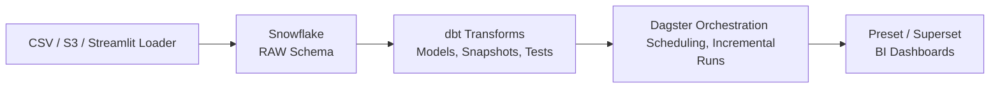

# Airbnb ELT Pipeline – DBT, Dagster, and Snowflake

## Introduction
This repository demonstrates a fully operational **Extract-Load-Transform (ELT)** pipeline tailored for an Airbnb-style dataset. By pulling raw CSVs into **Snowflake**, transforming them via **dbt**, and orchestrating those transformations with **Dagster**, this project highlights a modern, modular approach to data engineering. 
- The pipeline is designed to handle **incremental data loads**, automate **data-quality testing**, maintain a **historical snapshot** of changes, and deliver analytics-ready tables for visualization in **Preset (Superset)**. Under the hood, we employ Snowflake—a high-performance, cloud-native data warehouse capable of scaling compute and storage independently—and Dagster—a data orchestration platform providing fine-grained control over tasks, scheduling, and partitioning logic. This setup is beneficial for a wide range of data use cases: real-time analytics on user reviews, time-based aggregations of booking trends, or deeper reporting on host behaviors. The project’s primary focus is to provide a **scalable, testable, and maintainable** architecture that can serve as a prototype for real-world production pipelines in analytics engineering.

## Project Overview
This pipeline centers on **Snowflake** as the data warehouse and uses **dbt** for managing SQL-based transformations, tests, and documentation. **Dagster** orchestrates the entire workflow—scheduling and monitoring the data transformations, as well as handling incremental and partition-based runs.

1.  **Project Purpose**:
    
    -   To consolidate raw Airbnb data (listings, hosts, reviews) into a structured, analytics-ready format.
        
    -   To demonstrate best practices in **incremental loading**, **testing**, **documentation**, **snapshots** (Slowly Changing Dimensions), and **role-based access** using post-hooks.
        
    -   To offer a repeatable blueprint for similarly complex data engineering projects.
        
2.  **Technical Highlights**:
    
    -   **Incremental Models**: In `fct_reviews.sql`, new or updated data is appended rather than reprocessing the entire table on every run.
        
    -   **Snapshots (Type-2 SCD)**: Keep track of historical changes in listing/host attributes via `scd_raw_listings.sql` and `scd_raw_hosts.sql`.
        
    -   **Testing Framework**: dbt’s generic tests (unique, not_null, etc.) plus **dbt-expectations** for advanced validations (outlier detection, regex checks).
        
    -   **Exposures & Documentation**: Link final dbt models to your BI dashboards; generate user-friendly docs with lineage graphs.
        
    -   **Dagster Integration**: A dedicated orchestrator for scheduling tasks, monitoring logs, and performing partitioned backfills without rewriting dbt code.
        
3.  **Use Cases**:
    
    -   **Business Intelligence**: Present timely metrics to stakeholders on listing availability, pricing, or sentiment trends.
        
    -   **Data Science**: Build features off cleansed data, e.g., train a model to forecast booking demand.
        
    -   **Analytics & Reporting**: Empower teams to create dashboards, track superhost performance, or measure the effect of full moon nights on guest sentiment.
   
## Architecture Overview


1.  **Raw Data** is hosted in Snowflake’s `RAW` schema.
    
2.  **dbt** runs transformations into staging, dimension, and fact models in the `DEV` schema.
    
3.  **Dagster** handles scheduling, partitioning, and incremental runs.
    
4.  **Preset** (Superset) consumes final tables for analytics dashboards.

## Detailed ELT Workflow
Below is a more in-depth explanation of how **Extract, Load, and Transform** (ELT) occurs in this project:

### 1. Extract

-   **Data Source**: Airbnb-style CSV files covering listings, hosts, and reviews.
    
-   **Extraction Methods**:
    
    1.  **Local or S3**: Direct retrieval from S3 (`s3://dbtlearn/...`) or local folders.
       ```SQL
          -- Set up the defaults
              USE WAREHOUSE COMPUTE_WH;
              USE DATABASE airbnb;
              USE SCHEMA RAW;
              
              -- Create our three tables and import the data from S3
              CREATE OR REPLACE TABLE raw_listings
                                  (id integer,
                                   listing_url string,
                                   name string,
                                   room_type string,
                                   minimum_nights integer,
                                   host_id integer,
                                   price string,
                                   created_at datetime,
                                   updated_at datetime);
                                  
              COPY INTO raw_listings (id,
                                      listing_url,
                                      name,
                                      room_type,
                                      minimum_nights,
                                      host_id,
                                      price,
                                      created_at,
                                      updated_at)
                                 from 's3://dbtlearn/listings.csv'
                                  FILE_FORMAT = (type = 'CSV' skip_header = 1
                                  FIELD_OPTIONALLY_ENCLOSED_BY = '"');
                                  
              
              CREATE OR REPLACE TABLE raw_reviews
                                  (listing_id integer,
                                   date datetime,
                                   reviewer_name string,
                                   comments string,
                                   sentiment string);
                                  
              COPY INTO raw_reviews (listing_id, date, reviewer_name, comments, sentiment)
                                 from 's3://dbtlearn/reviews.csv'
                                  FILE_FORMAT = (type = 'CSV' skip_header = 1
                                  FIELD_OPTIONALLY_ENCLOSED_BY = '"');
                                  
              
              CREATE OR REPLACE TABLE raw_hosts
                                  (id integer,
                                   name string,
                                   is_superhost string,
                                   created_at datetime,
                                   updated_at datetime);
                                  
              COPY INTO raw_hosts (id, name, is_superhost, created_at, updated_at)
                                 from 's3://dbtlearn/hosts.csv'
                                  FILE_FORMAT = (type = 'CSV' skip_header = 1
                                  FIELD_OPTIONALLY_ENCLOSED_BY = '"');
    
        
   ii.  **Streamlit Importer**: A web app that quickly pushes CSV data into Snowflake. [Streamlit Importer](https://dbt-data-importer.streamlit.app/)

        
-   **Goal**: Acquire raw data in its original format without altering structure.
    

### 2. Load

-   **Destination**: Data is loaded into Snowflake’s `RAW` schema (in the `AIRBNB` database).
    
-   **Load Mechanisms**:
    
    -   **Manual SQL Scripts** (e.g., `COPY INTO` commands referencing CSV files).
        
    -   **Automated Tools** like the Streamlit-based importer.
        
-   **Result**: Three raw tables (`RAW_LISTINGS`, `RAW_HOSTS`, `RAW_REVIEWS`) store the untransformed data.
    

### 3. Transform

1.  **dbt Layers**
    
    -   **Staging Models** (`src_listings.sql`, `src_reviews.sql`, etc.): Provide a clean, first-layer transform from raw tables (renames, type casting).
        
    -   **Dimensions & Facts** (`dim_listings_cleansed.sql`, `fct_reviews.sql`, etc.): Further cleansing, joining, and incremental logic.
        
    -   **Snapshots**: SCD Type-2 snapshots (`scd_raw_listings.sql`, `scd_raw_hosts.sql`) track row-level changes historically.
        
    -   **Seeds**: Additional data (like `seed_full_moon_dates.csv`) for extended analyses.
        
    -   **Testing & Documentation**: Validate transformations with built-in tests, `dbt-expectations`, and document tables in `schema.yml`.
        
2.  **Execution**
    
    -   **Manual**: Developers run `dbt run` or `dbt test` from the CLI.
        
    -   **Dagster**: Automates scheduling, partitioning (e.g., by date), and orchestrates these runs in a production-like environment.
        
3.  **Outcome**
    
    -   **Analytics-Ready Tables** stored in the `DEV` schema.
        
    -   **Clean Dimensions** for hosts/listings, and **Fact Tables** for reviews with incremental updates.
        
    -   **Historical Snapshots** capturing how listings and hosts changed over time.
        
    -   **Rigorous Testing** ensures data quality at each step.
        

By the end of the transformation phase, data is shaped precisely for downstream analytics or data science tasks, with each step validated and documented.

## Repository Structure
Below is a typical folder layout you might see in this project. **All directories and files serve distinct purposes in building, testing, and orchestrating the pipeline**

```mermaid
flowchart TB
    A[DBT-UDEMY-Root]
    A --> B[dagster_venv]
    A --> C[dbt]
    A --> D[dbt_venv]
    A --> E[dbtlearn]
    A --> F[logs]
    A --> G[requirements.txt]

    subgraph dbtlearn_folder [dbtlearn]
        direction TB
        E1[.vscode]
        E2[analyses/]
        E3[assets/]
        E4[macros/]
        E5[models/]
        E6[seeds/]
        E7[snapshots/]
        E8[target/]
        E9[tests/]
        E10[.gitignore]
        E11[dbt_project.yml]
        E12[package-lock.yml]
        E13[packages.yml]
        E14[README.md]

        E --> E1
        E --> E2
        E --> E3
        E --> E4
        E --> E5
        E --> E6
        E --> E7
        E --> E8
        E --> E9
        E --> E10
        E --> E11
        E --> E12
        E --> E13
        E --> E14
    end

    subgraph logs_folder [logs]
        F1[dbt.log]
        F --> F1
    end

    subgraph models_folder [dbtlearn/models]
        M1[dim/]
        M2[fct/]
        M3[mart/]
        M4[src/]
        M5[dashboards.yml]
        M6[docs.md]
        M7[overview.md]
        M8[schema.yml]
        M9[sources.yml]

        E5 --> M1
        E5 --> M2
        E5 --> M3
        E5 --> M4
        E5 --> M5
        E5 --> M6
        E5 --> M7
        E5 --> M8
        E5 --> M9
    end

    subgraph dim_folder [dim]
        DM1[dim_hosts_cleansed.sql]
        DM2[dim_listings_cleansed.sql]
        DM3[dim_listings_w_hosts.sql]
        M1 --> DM1
        M1 --> DM2
        M1 --> DM3
    end

    subgraph fct_folder [fct]
        FC1[fct_reviews.sql]
        M2 --> FC1
    end

    subgraph mart_folder [mart]
        MA1[mart_fullmoon_reviews.sql]
        M3 --> MA1
    end

    subgraph src_folder [src]
        SR1[src_hosts.sql]
        SR2[src_listings.sql]
        SR3[src_reviews.sql]
        M4 --> SR1
        M4 --> SR2
        M4 --> SR3
    end

    subgraph snapshots_folder [dbtlearn/snapshots]
        SS1[scd_raw_listings.sql]
        E7 --> SS1
    end

    subgraph tests_folder [dbtlearn/tests]
        T1[consistent_created_at.sql]
        T2[dim_listings_minimum_nights.sql]
        T3[no_nulls_in_dim_listings.sql]
        E9 --> T1
        E9 --> T2
        E9 --> T3
    end
```



**How It All Fits Together**:

-   **`src/` folder** taps into Snowflake’s raw tables and transforms them into staging views or ephemeral sets.
    
-   **`dim/`, `fct/`, `mart/` folders** house more advanced transformations, each building on the previous layer.
    
-   **`snapshots/`** ensures you track changes in raw tables over time.
    
-   **`tests/`, `macros/`** let you add custom validations and Jinja templates for reusability.
    
-   **`dagster_project/`** provides Pythonic orchestration, scheduling, and partition logic for your dbt runs.

## Setup & Installation

1.  **Clone the Repo**
    `git clone https://github.com/yourname/Airbnb-ELT-pipeline--DBT-Dagster-Snowflake-.git cd Airbnb-ELT-pipeline--DBT-Dagster-Snowflake-`
    
2.  **Create/Activate a Virtual Environment** (Mac/Linux)

    
    `python3 -m venv venv source venv/bin/activate` 
    
    (Windows)    
    `python -m venv venv
    .\venv\Scripts\activate` 
    
3.  **Install Dependencies**    
    `pip install -r requirements.txt` 
    
    Ensure you have `dbt-snowflake`, `dagster`, and any other required packages (e.g. `dbt-expectations`) installed.
    
4.  **Configure Snowflake**
    
    -   Create a `profiles.yml` (in `~/.dbt/` on Mac/Linux or `%USERPROFILE%\.dbt\` on Windows).
        
    -   Example snippet:
    ``dbtlearn:
  target: dev
  outputs:
    dev:
      type: snowflake
      account: <your_snowflake_account>
      user: <your_username>
      password: <your_password>
      role: TRANSFORM
      database: AIRBNB
      warehouse: COMPUTE_WH
      schema: DEV``
      
## Data Ingestion

You can ingest Airbnb data into Snowflake via:

1.  **Streamlit App** – [dbt-data-importer.streamlit.app](https://dbt-data-importer.streamlit.app/)
    
2.  **Manual SQL Scripts** – Found in `snowflake_import.sql` or directly from S3.
    

This populates three raw tables: `RAW_LISTINGS`, `RAW_HOSTS`, and `RAW_REVIEWS` in Snowflake’s `RAW` schema.

## dbt Transformations

1.  **Source & Staging Models**
    
    -   `src_listings.sql`, `src_reviews.sql`, `src_hosts.sql` represent ephemeral or view-based staging layers.
        
    -   `sources.yml` references raw Snowflake tables with source freshness policies.
        
2.  **Dimension & Fact Models**
    
    -   `dim_listings_cleansed.sql`, `dim_hosts_cleansed.sql`, `fct_reviews.sql` show how you **clean** and **enrich** data.
        
    -   **Incremental** logic in `fct_reviews.sql` only processes new/updated records for efficiency.
        
3.  **Snapshots**
    
    -   `scd_raw_listings.sql` and `scd_raw_hosts.sql` implement **Slowly Changing Dimensions (Type 2)** to preserve historical context.
        
4.  **Seeds**
    
    -   `seed_full_moon_dates.csv` loads data for correlating review sentiment with full moon phases.
        
5.  **Hooks & Grants**
    
    -   `dbt_project.yml` includes post-hooks like `GRANT SELECT ON {{ this }} TO ROLE REPORTER` to manage role-based access.

## Testing & Data Quality

1.  **dbt Native Tests**
    
    -   Defined in `schema.yml` (e.g., `unique`, `not_null`, `accepted_values` on columns).
        
2.  **Custom Singular Tests**
    
    -   Queries in `tests/` (e.g., `consistent_created_at.sql`) verifying business logic (no review before listing creation).
        
3.  **dbt-expectations**
    
    -   Enhanced data checks (`expect_column_values_to_not_match_regex`, outlier detection, etc.).

	Run:
	`dbt test` 

	or selectively:
	`dbt test --select dim_listings_w_hosts`
	`dbt test --select  source:airbnb.listings`

## Orchestration with Dagster

-   The project uses **Dagster** to coordinate and schedule dbt runs:
    
    1.  **Assets**: `assets.py` defines dbt assets referencing your dbt project’s `manifest.json`.
         
        
    3.  **Schedules**: `schedules.py` sets up daily or time-based triggers for incremental runs.
       
        
    4.  **Partitioning**: Dagster can partition the `fct_reviews` model by dates, passing `start_date` and `end_date` vars to dbt.
         
    

    

     
        

### Background on Dagster

Dagster is a **modern data orchestration platform** focused on making data pipelines:

-   **Modular**: Each asset (or step) is defined as code, making partial rebuilds straightforward.
    
-   **Observable**: Detailed logging and run metadata help you monitor each step of the pipeline.
    
-   **Flexible**: Integrates seamlessly with dbt, enabling parameterized runs and partition-based scheduling.
    

### Running Dagster Locally
	`cd dagster_project`
	`DAGSTER_DBT_PARSE_PROJECT_ON_LOAD=1 dagster dev`
Open your browser at http://localhost:3000/ to see real-time logs, runs, and partition statuses.

## Visualization (Preset/Superset)

-   **Preset** (Superset) connects to Snowflake with a standard SQLAlchemy URI.
    
-   You can build dashboards that reflect:
    
    -   **Listings & Pricing**
        
    -   **Review Sentiment**
        
    -   **Full-Moon vs. Not-Full-Moon** comparisons
        
-   If you used dbt exposures, your `dashboard.yml` or similar file helps track lineage from dbt models to the BI layer.
    
    
     
## References

1.  [dbt Documentation](https://docs.getdbt.com/) – especially [Incremental Models](https://docs.getdbt.com/docs/build/incremental-models#about-incremental_strategy).
    
2.  [Dagster dbt Integration](https://docs.dagster.io/integrations/libraries/dbt).
    
3.  [dbt-expectations on GitHub](https://github.com/calogica/dbt-expectations).
    
4.  [Preset (Superset)](https://preset.io/) for dashboarding.
    
5.  Snowflake Docs for warehouse setup and management.
    

### Background on Snowflake

Snowflake is a **cloud-native data warehouse** that separates compute from storage. This design offers:

-   **Automatic Scaling**: Spin up multiple virtual warehouses for different workloads.
    
-   **Cost Efficiency**: Pause warehouses when not in use.
    
-   **High Concurrency & Availability**: Support multiple, simultaneous data engineering and BI tasks without locking or performance degradation.
  


